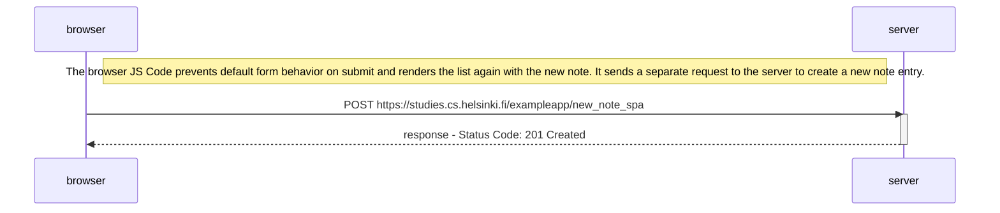

```mermaid
sequenceDiagram
    participant browser
    participant server

    Note right of browser: The browser JS Code prevents default form behavior on submit and renders the list again with the new note. It sends a separate request to the server to create a new note entry.
    browser->>server: POST https://studies.cs.helsinki.fi/exampleapp/new_note_spa
    activate server
    server-->>browser: response - Status Code: 201 Created 
    deactivate server
```